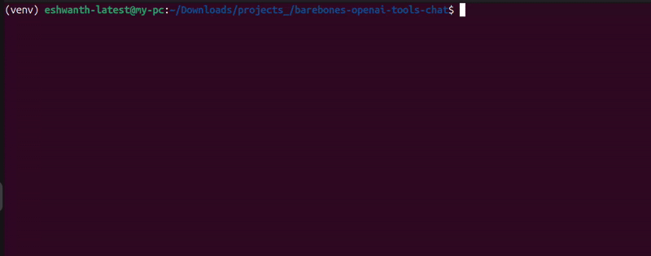

# Minimal-openai-tools-chat
This is a barebones Python demo that showcases how to build a simple conversational agent (in terminal) using OpenAI's API with tool calling. The focus is on the core logic, clarity and simplicity — no external frameworks or complex abstractions.

> 🔧 Just Python + OpenAI API — nothing more.

This example uses basic math tools (`add`, `subtract`, `multiply`, `divide`) to demonstrate the key components of tool calling:
- Defining tools as functions
- Detecting when the model wants to use them
- Executing the function with provided arguments
- Feeding the result back into the conversation for further reasoning

This code is intended as a **simple, functional starting point**, and easy to plug your own tools or logic.


## Simple demo



## Getting started
1. Install requirements using the command: `pip install -r requirements.txt`
1. Make sure the OpenAI API key is in the environment. You can do `export OPENAI_API_KEY=<YOUR_KEY>` from the terminal.
1. Then, run the command: `python run_chat_script.py`.

## A Few Practical Details
1. Auto-generating Tool Definitions from Python Functions:

	OpenAI's tool calling requires every tool to be defined in a JSON schema — specifying parameters, types, and descriptions. Manually writing these schemas becomes tedious, especially if you're working with multiple or complex functions.

	To keep things simple, this project includes a helper function: func_to_json (source: [funkagent](https://github.com/aurelio-labs/funkagent/blob/main/funkagent/parser.py)). It uses Python type hints and docstrings to auto-generate valid tool definitions — reducing boilerplate and making it easy to scale.

	There are other tools like Lunary's [tool call generator](https://lunary.ai/tool-calls-generator) as well though I haven't tested their support for more complex use cases.

2. Parallel Tool Calling (Optional)

	By default, the script enables parallel tool calling, allowing the model to call multiple tools in a single turn if needed. However, in this script, it's disabled to let the model solve math expressions step by step — for example, evaluating "555 * 222 - 121" in sequence. To enable it, you can set `parallel_tool_calls` to `True`.
	```python
	response = client.chat.completions.create(
	    ...
	    parallel_tool_calls=True
	)
	```
